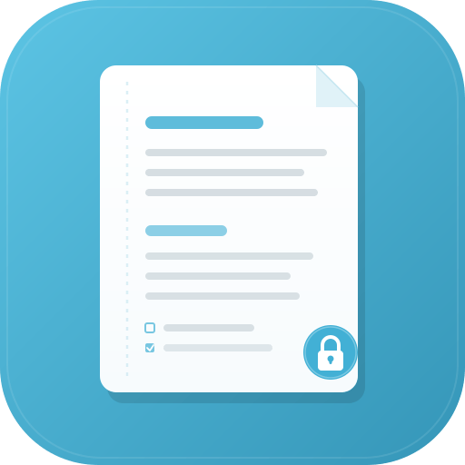
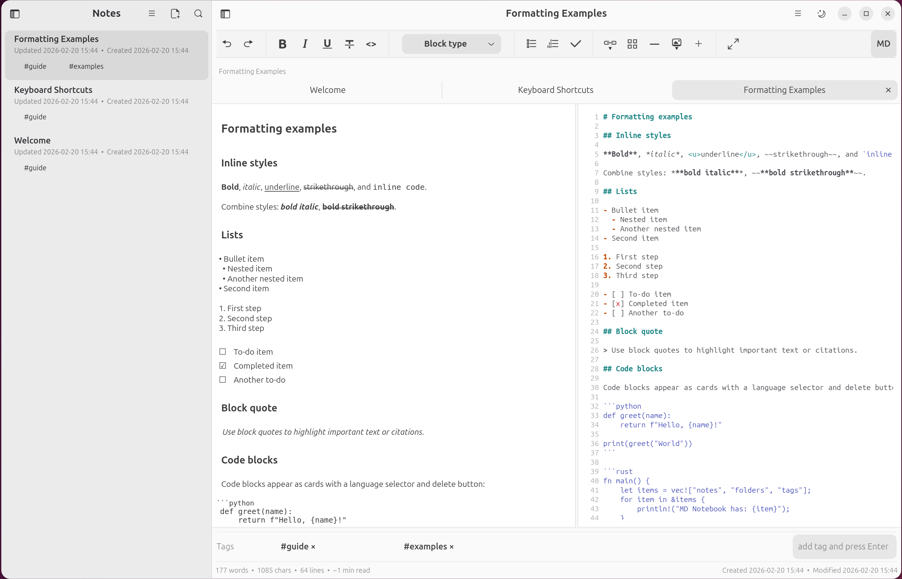
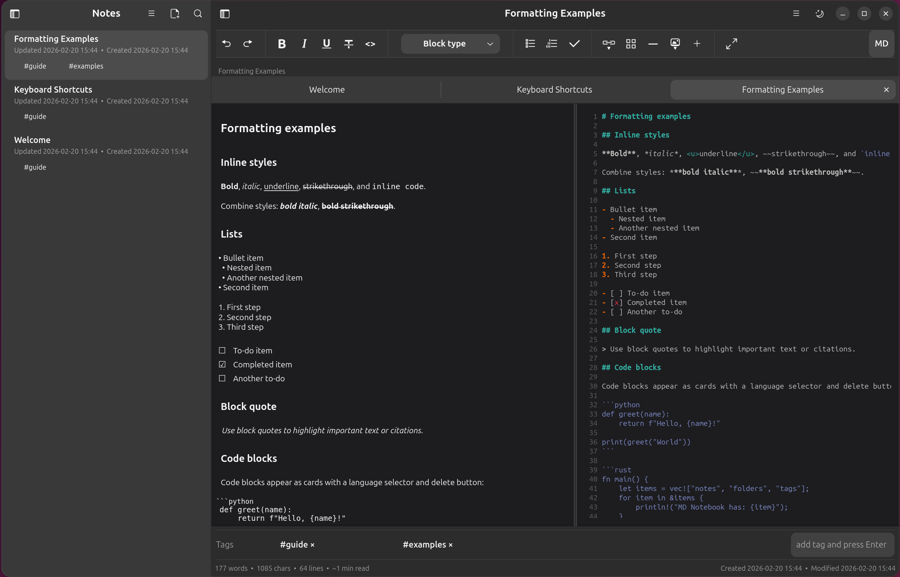
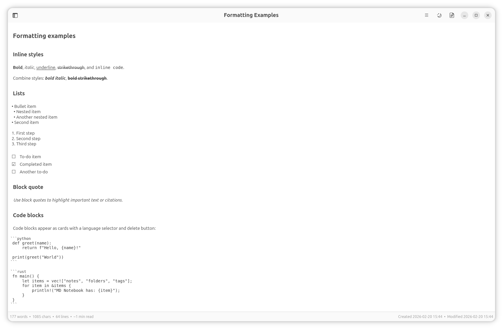
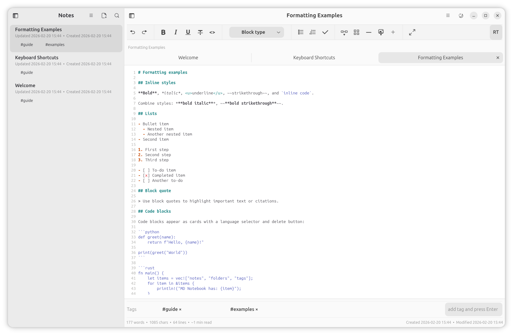

<p align="center">
  
</p>

<h1 align="center">MDNotebook</h1>

<p align="center">
  A private, encrypted markdown notebook for Linux.
  <br />
  Your notes never leave your machine.
</p>

---

## Why MDNotebook?

Most note-taking apps sync your data to someone else's server. MDNotebook doesn't. Every note is encrypted with AES-256-GCM on your device. There are no accounts, no cloud, no telemetry — just your notes, your machine, your data.

This is the native Linux edition, built from the ground up with GTK 4 and Libadwaita for a fast, lightweight experience that feels at home on GNOME.

## Screenshots

| Light Mode | Dark Mode |
|:---:|:---:|
|  |  |

| Zen Mode | Source View |
|:---:|:---:|
|  |  |

---

## Features

### Encrypted Vault
Your entire notebook is encrypted with a passphrase you choose. AES-256-GCM encryption with PBKDF2 key derivation (600,000 iterations). The passphrase is never stored anywhere — lose it and your data is gone. That's the point.

### Rich Markdown Editor
WYSIWYG editing with a formatting toolbar, code blocks with syntax highlighting (14 languages), tables, task lists, images, and more. Everything is stored as standard Markdown. Toggle between rich-text and source views at any time.

### Wiki Links & Backlinks
Link notes together with `[[Note Name]]` syntax. A backlinks panel shows every note that references the current one.

### Organization
- **Folders** — Nest notes in folders, create and rename from the sidebar
- **Tabs** — Open multiple notes, drag to reorder, close with `Ctrl+W`
- **Tags** — Filter by AND/OR logic with a collapsible sidebar panel
- **Search** — Search note titles with `Ctrl+Shift+F`
- **Daily notes** — One-click creation with `Ctrl+Shift+T`
- **Templates** — Create notes from built-in or custom templates
- **Sort** — By name, date created, or date modified (ascending/descending)
- **Version history** — Save named snapshots and restore earlier content

### Writing
- **Zen mode** — Distraction-free writing with `Ctrl+Shift+J`
- **Code blocks** — Fenced blocks with language selector for 14 languages
- **Encrypted image storage** — Drag images into the editor; each image is encrypted and stored as a separate vault asset
- **Markdown & HTML export** — Export individual notes from the menu
- **Import** — Import `.md` files with `Ctrl+O`
- **Command palette** — Quick access to all actions with `Ctrl+Shift+P`

### Desktop Integration
- **Dark mode** — Toggle with button or `Ctrl+Shift+D`
- **Fullscreen** — `F11` for immersive editing
- **Adaptive layout** — Sidebar collapses to overlay on narrow windows
- **Auto-save** — Saves periodically with debounced vault writes
- **Libadwaita** — Native GNOME look and feel

---

## Keyboard Shortcuts

| Shortcut | Action |
|----------|--------|
| `Ctrl+N` | New note |
| `Ctrl+S` | Save |
| `Ctrl+Shift+S` | Save as |
| `Ctrl+O` | Import file |
| `Ctrl+W` | Close tab |
| `Ctrl+Shift+F` | Focus search |
| `Ctrl+Shift+T` | Daily note |
| `Ctrl+Shift+D` | Toggle dark mode |
| `Ctrl+Shift+J` | Toggle zen mode |
| `Ctrl+Shift+P` | Command palette |
| `Ctrl+\` | Toggle sidebar |
| `F1` | Help |
| `F2` | Rename note |
| `F11` | Fullscreen |

### Formatting

| Shortcut | Action |
|----------|--------|
| `Ctrl+B` | Bold |
| `Ctrl+I` | Italic |
| `Ctrl+U` | Underline |
| `Ctrl+D` | Strikethrough |
| `Ctrl+E` | Inline code |
| `Ctrl+K` | Insert link |
| `Ctrl+1` – `Ctrl+6` | Heading 1–6 |
| `Ctrl+Shift+Q` | Block quote |
| `Ctrl+Shift+L` | Bullet list |
| `Ctrl+Space` | Toggle checkbox |
| `Ctrl+Z` | Undo |
| `Ctrl+Shift+Z` | Redo |

---

## Security

| | |
|---|---|
| **Encryption** | AES-256-GCM with PBKDF2-SHA256 (600k iterations) |
| **Storage** | Passphrase never stored; vault unlocked once per session |
| **Assets** | Images encrypted individually alongside the vault |
| **Network** | Zero outbound connections |
| **Telemetry** | None. No analytics, no tracking, no cloud sync |

---

## Build from Source

### Prerequisites

- [Rust](https://rustup.rs/) (latest stable)
- GTK 4, Libadwaita, and GtkSourceView 5 development libraries

#### Ubuntu / Debian

```bash
sudo apt install -y \
  build-essential pkg-config \
  libgtk-4-dev libadwaita-1-dev libgtksourceview-5-dev
```

#### Fedora

```bash
sudo dnf install -y \
  gcc pkg-config \
  gtk4-devel libadwaita-devel gtksourceview5-devel
```

#### Arch

```bash
sudo pacman -S base-devel gtk4 libadwaita gtksourceview5
```

### Commands

```bash
cargo run              # Development mode
cargo test             # Run tests
cargo build --release  # Production build (binary at target/release/mdnative-editor)
```

---

## Tech Stack

| Layer | Technology |
|-------|-----------|
| Toolkit | GTK 4.0, Libadwaita 1.5 |
| Source view | GtkSourceView 5 |
| Language | Rust (2021 edition) |
| Encryption | aes-gcm, pbkdf2, sha2 |
| Markdown | pulldown-cmark |
| Serialization | serde, serde_json |

---

## Project Structure

```
├── Cargo.toml
├── data/
│   └── icons/              # App icon
├── src/
│   ├── main.rs             # Entry point, GtkApplication setup
│   ├── crypto.rs           # AES-256-GCM encryption, PBKDF2 key derivation
│   ├── vault.rs            # Vault file format, JSON serialization, config
│   ├── state.rs            # DocState, NoteItem, FolderItem, TrashItem
│   ├── wysiwyg.rs          # Rich text ↔ Markdown parser/serializer
│   ├── signals.rs          # Actions, event wiring, all application logic
│   ├── markdown.rs         # Markdown → HTML (for HTML export)
│   ├── preview.rs          # Preview utilities
│   └── ui/
│       ├── types.rs        # EditorCtx, widget struct definitions
│       ├── window.rs       # Window builder, content pane assembly
│       ├── sidebar.rs      # Sidebar pane with search, notes list, folders
│       ├── toolbar.rs      # Formatting toolbar
│       └── dialogs.rs      # Help, about, shortcuts, vault dialogs
└── style.css               # Application stylesheet
```

## Vault Format

The vault is a single encrypted file (`vault.mdnb`) stored in a user-chosen folder. On disk it contains a base64-encoded blob: `salt (16 bytes) || IV (12 bytes) || AES-256-GCM ciphertext`. The plaintext is a JSON document holding the full note tree, folders, trash, open tabs, theme, sort order, templates, and version history. Image assets are stored as separate encrypted files in an `assets/` subdirectory alongside the vault.

---

## Changelog

### v0.1.0
- Initial native Linux release
- WYSIWYG rich-text editor with live Markdown source pane
- AES-256-GCM encrypted vault with PBKDF2 key derivation (600k iterations)
- Encrypted image storage — drag-and-drop images encrypted as separate vault assets
- Sidebar with nested folders, tags, search, and sort
- Tabbed editing with drag-to-reorder
- Code blocks with syntax highlighting for 14 languages
- Wiki links and backlinks
- Version history with named snapshots and restore
- Daily notes, templates, and command palette
- Zen mode, dark/light theme toggle, fullscreen
- Import Markdown files, export as Markdown or HTML
- Built with GTK 4, Libadwaita, and GtkSourceView 5

## License

[GPL-3.0](LICENSE)
